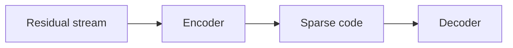

The first paragraph becomes the excerpt on the blog index and homepage unless
`description` is set in the front matter.

## Headings and prose

Body text is set for long-form reading. Use *emphasis*, **strong text**, `inline code`,
and footnotes where a tangent would break the flow.[^tangent]

> A blockquote works for quotations and pull-quotes.

> Add a class after a blockquote to turn it into a callout.
{: .note }

## Math

MathJax loads only on pages that contain math. Inline math uses double dollars,
like $$\|W x\|_2 \le \sigma_{\max}(W)\,\|x\|_2$$, and display math sits on its own lines:

$$
\mathcal{L}_{\text{SAE}} = \big\|x - W_d\,\mathrm{TopK}(W_e x + b_e)\big\|_2^2
$$

## Code

```python
def top_k(z, k):
    """Keep the k largest activations."""
    idx = z.abs().topk(k, dim=-1).indices
    return torch.zeros_like(z).scatter(-1, idx, z.gather(-1, idx))
```

## Figures

Put images in `assets/images/blog/` and wrap them in a figure when they need a caption:

<figure>
  
  <figcaption>Figure 1. A caption set in the muted ink colour.</figcaption>
</figure>

## Diagrams



| Method | L0  | MSE   |
| ------ | --- | ----- |
| TopK   | 32  | 0.041 |
| AbsTopK| 32  | 0.036 |

[^tangent]: Footnotes collect at the end of the post, with a link back to where they were cited.
